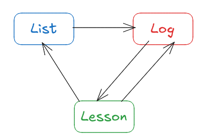

# List Kit
- リストを管理するためのフレームワーク
- どのように管理するかを決めるためのヒントを提示する
- 管理とは設計、作成、運用、配布を含む

# Tools
3Lサイクル:

```markdown
## List (ここにタイトル)
- (リストの内容)
- ...

## Log
- (使ってみた感想、経過や結果)
- ...

## Lesson
- (ログに基づいた考察とそこから得られたこと)
- ...
```

3Lサイクル論点:

```
- 3L は同じファイル内に書く？それとも分ける？
- Log と Lesson のタイムスタンプはどう書く？どう区切る？
- Log と Lesson の記入タイミングは？
- Log と Lesson の記入フォーマットは？
```

リストを使うタイミングを設計する際のトリガーリスト:

```markdown
- As an input ですか？
    - 例: ～～を行う前のインプットとして読んでおこう
- As a tool ですか？
    - 例: ～～をするために使えるので使おう
- As an output ですか？
    - 例: 今から～～を残したいので、リストの形で残そう
...
```

リストの使い方を設計する際のトリガーリスト:

```
- 順序性：上から順に見るかどうか
- 記入性：答えを書き込むかどうか
- 即時性：その場で行動させるかどうか（思考と記入は含めない。典型例は手順）
- 任意性：その項目をスルーしてもいいかどうか
```

リストをどうやって使い始めるかを設計する際のトリガーリスト:

```
- そのリストの存在はいつ、どうやって思い出しますか？
- そのリストの存在を思い出させるための合図や仕組みはありますか？つくれますか？
- そのリストにはどうやってアクセスしますか？
- そのリストが記入を伴う場合、記入可能なファイルやページや用紙はどのようにしてつくりますか？
```

リストのつくり方を考えるためのトリガーリスト:

```
## 手段
- プレーンテキスト？: txt, Markdown etc
- リッチテキスト？: Word, PDF etc
- スライド？: Powerpoint, Keynote etc
- キャンバス？: Miro, Figma, Canva etc
- スプレッドシート？: Excel, Googleスプレッドシート etc
- ノートページ？: Google ドキュメント, Notion etc

## 観点
- 保存のしやすさ
- アクセスのしやすさ
- 記入のしやすさ
- 共有のしやすさ
```

# 参考: 3Lサイクル
リストをつくって運用するためのサイクル。



3 要素について:

- List:
    - リストをつくる
    - Lesson の結果を受けて、リストを修正する
- Log:
    - リストを使った経過や結果を記録する
- Lesson:
    - Log の内容に基づいて考察を行い、学びを書く

サイクルについて:

- 典型的には最初にリストをつくり、Log と Lesson を繰り返す
    - List → Log → Lesson → Log → Lesson → ...
- リストの修正は Lesson を経て行う
    - ... → Lesson → List → Log → ...
